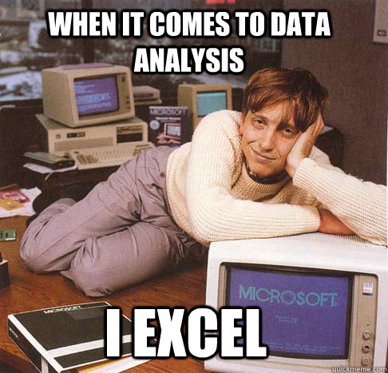
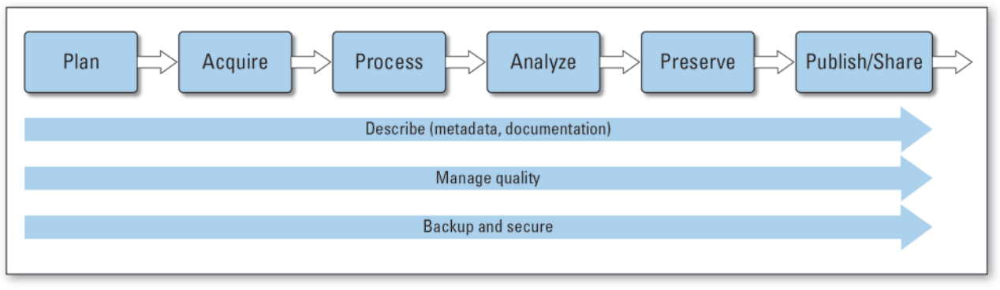
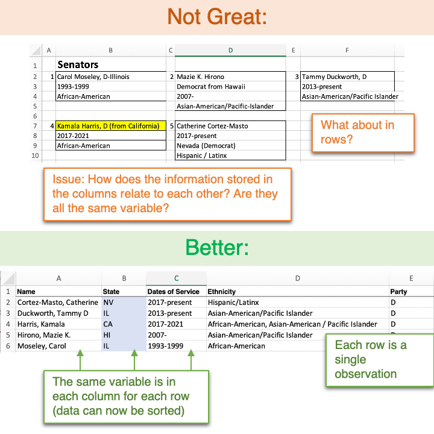
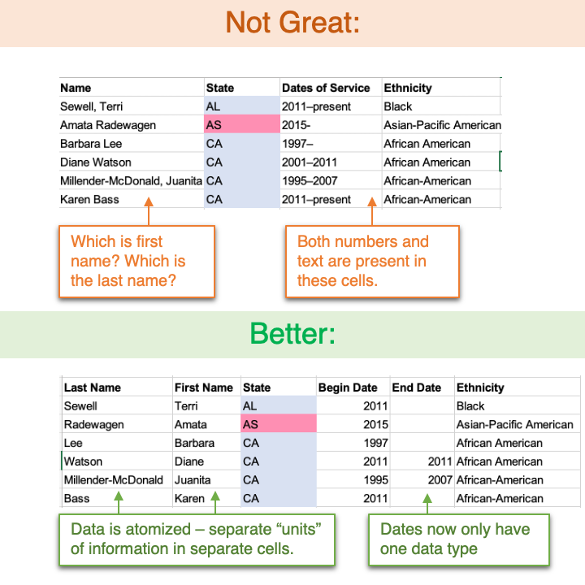
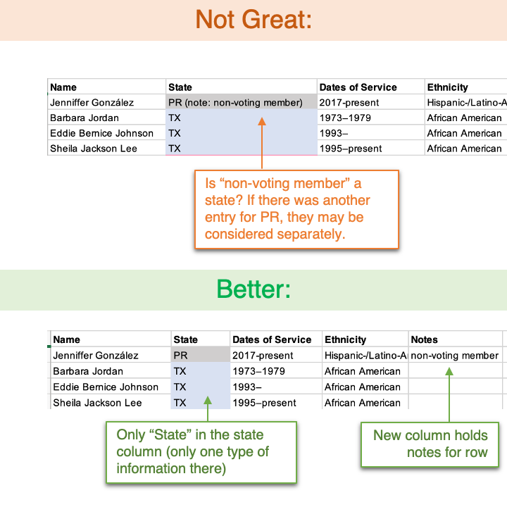
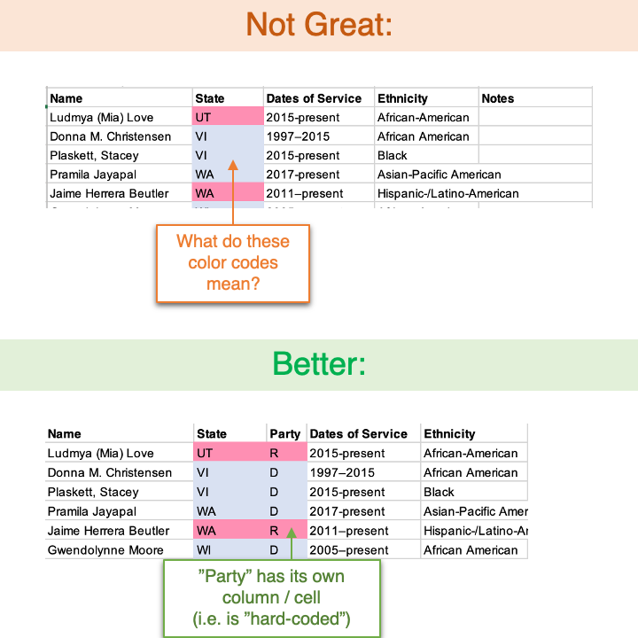
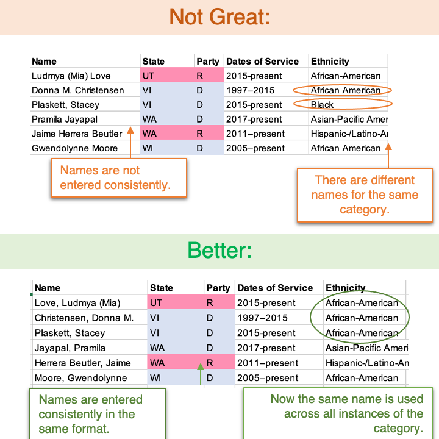
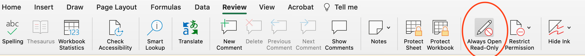
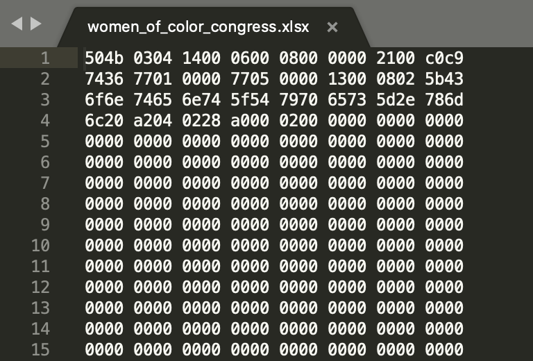

```{r, echo=FALSE}
url1 <- "https://datalab.ucdavis.edu/cstahmer/git_workshop_images/mac_finder_1.png"
library(knitr)
```

{ width=250px height=250px}

# Overview

This workshop introduces learners to best practices for data entry and organization for data-driven projects. With interactive, hands-on examples we’ll practice using data validation tools including filters, restricted vocabularies, and flags in Microsoft Excel. These skills are also applicable to working in Google Sheets, LibreOffice, and other spreadsheet software. At the end of the workshop, learners should be able to identify the best practices for designing a spreadsheet and entering data, compare different data formats, and be able to use spreadsheet software for basic data validation. This workshop is designed for learners who have basic familiarity with spreadsheet programs. No coding experience is required.  All participants will need a computer with Microsoft Excel 2016 or newer, and the latest version of Zoom. 

# Introduction

## Learning Objectives 

After this workshop, participants should be able to:

  * describe the steps in the lifecycle of a data-driven project
  * identify best practices for entering and formatting data in spreadsheets 
  * use tools in Microsoft Excel for data validation and filtering 
  * define restricted vocabularies, data dictionaries and filter keys
  * compare the advantages of different data file formats


## Before Excel: The Data Lifecycle {#datalifecycle}

Before we begin entering and organizing our data in spreadsheets, we consider the paths our data takes as it moves through our data-driven project as a whole. Where does our data come from? Where is going, what are we going to do with it? Who is it ultimately for? Data scientists call this process the **"data lifecycle"**. 


*Note: There are many different versions of the data lifecycle, but we particularly like those of the [US Geological Survey](https://pubs.usgs.gov/of/2013/1265/pdf/of2013-1265.pdf) and [DataOne](https://old.dataone.org/data-life-cycle). Our data cycle steps below are based on both of those sources*  (Image Source: [USGS](https://pubs.usgs.gov/of/2013/1265/pdf/of2013-1265.pdf))


The steps of the data cycle: 

  * **Plan**: plan what data will be collected, how it will be processed, analyzed and stored throughout the project
  * **Acquire**: collect data, through measurement tools and observations, (i.e. survey instruments, interview transcripts, GPS location loggers, molecular sequencing assays, behavioral observations, etc.) and enter the data in digital form
  * **Process**: process data to assure quality, clean and format the data for downstream analyses and storage
  * **Analyze**: explore and interpret patterns in data, summarize and visualize results, test hypotheses using statistics, and report conclusions
  * **Preserve**: store data in secure way and in formats that ensure long-term accessibility and reuse
  * **Publish/Share**: distribute data through peer-reviewed publications or submitted reports, and archive data in field-appropriate data depositories/archives for future access and analysis. 

The following processes occur throughout the data lifecycle: 

  * **Describe **: document sources of data, keep records of analysis or processing throughout all steps, record keys to codes and dataset-specific variables, and log history of dataset use. 
  * **Manage quality **: follow best practices at all steps to ensure quality, transparency and reproducibility throughout the data process. 
  * **Backup and secure ** : back-up and secure data in reliable, accessible storage locations at all steps of the process
  
When working with Excel, many of us are often at "Acquire" and "Process" stages of this lifecycle. 
In this workshop, we will illustrate best practices that will help with first-time data entry (**Acquire**), data validation, cleaning and filtering (**Process**) as well as discuss formats and version control that will help with preserving data for reuse and accessibility (**Preserve**). 


### Interested in documenting your data? {#readme_workshop}

In an upcoming workshop (March 4th, 2021), we will be discussing metadata and documentation for data-driven projects. This workshop will delve more into the **Describe** process at all steps. (See [here](https://datalab.ucdavis.edu/eventscalendar/readme-write-me/) for more information.)

# Spreadsheet Best Practices 

In this section, we list some of the best practices to follow when entering and arranging data in Excel. These quick tips will help with data analysis and interpretation down the line, making your data more shareable and reproducible. 

## 1. Keep variables in columns, observations in rows. {#one}

In a spreadsheet (or data stored in a tabular form), the smallest "unit of measurement" is a **cell**, such as cell A1. It is best practice to place your variables in columns, and separate observations in rows. Then, all the cells in a row will be part of one observation (each defining a different variable) and all the cells in a column will represent values of that variable across observations. 

**Why do this?**  This follows the formats and style of many other data processors, such as more formal, SQL-based relational databases and the ["tidy" format](https://r4ds.had.co.nz/tidy-data.html) facilitated by coding in languages like R.

**Examples**: 



## 2. Stick to one datatype per variable/column. {#two}

With your variables in columns, it is best to stick to one datatype per variable. A **datatype** defines what kind of data is being stored, such as numerical data, integers, text or character strings, or dates, for example. As you define your variable columns (as in #1), ask yourself: *What would the data type for this column be?* For example, date_of_birth would be a date, distance_km would be a number, question10_response may be a character string of text. 

Considering that the cell is the smallest "unit of measurement", each cell in the variable column should ideally be of the same type, and should contain only that type. If you find that some of your cells have multiple types within them, it may be worth creating a new variable/column to store and differentiate this data, such as a "unit" column, or a "notes" column (see [#3](#three)). 

Lastly, make sure that you aren't inadverently storing multiple "units" of information in one cell, even if they are the same type (e.g. numbers). Some common examples are including birth and death dates (a range) in one cell, or latitude and longitude in the same cell in a column. 

**Why do this?**  This will facilitate analyses down the line. Have you ever tried to sort a column in Excel and gotten the annoying error that asks you to "sort everything that looks like a number like a number"? This will helo avoid this issue, but will also allow you to accurately use functions like sort, calculate sums, averages, and run analyses on variables as separate units, without having your data be "polluted" by excess information. 
Further, if you end up exporting your data to coding languages or other data processors, you may lose data that does not match the type exported, or experience errors where these mismatched types are converted into new values or into NAs. 

**Examples**: 



## 3. Add notes and comments in separate columns. {#three}

Given that we should enter one data unit / type into our columns (above), a common follow up is: *What about notes, though?* Of course, it's important including notes, comments, and disclaimers about samples or observations. However, including these directly in your cells along with data points will lead to the problems downstream in analysis solved by #2. As a solution, create a new column called "notes" or "comments". If you'd like to restrict notes to certain variables, you can have multiple notes columns, and include this in their column names.

It's best to avoid

  * adding notes directly in cells with your data points
    * This includes asterisks, or "see notes" notes!
  * using the hovering comments function found in "Review" 
    * This will be lost outside of Excel (see #X about non-proprietary formats) 
  * using color-coding to highlight issues or questionable cells
    * see [#4](#four) 

**Why do this?** As in [#2](#two), this avoids multiple types in cells that can muck up downstream analysis or imports into programming languages or other softwares. This also keeps variables "atomized" and organized into the smallest units of information, helping your collaborators (including future you!) find information easier. 

**Examples**: 



## 4. Code information explicitly in cells rather than in formatting. {#four}

While using color codes, bold and italics to indicate information about data points is tempting, it is best to avoid actually storing or coding information in formats. Instead of using color codes, make this information coded by color or font format explicit its own column. 

**Why do this?**  Data included in these formatting is not made explicit (i.e. is not stored in a cell, in a recognizeable data type). These formats will thus be hard to analyze (how do you search for or sort by a color?). Further, these formats are Excel-specific and will be lost in other data formats (see #X) and when exported into programming languages or other data processors. 

**Examples**: 



## 5. Be consistent with variable names and codes. 

Often, variable levels or categories may be very long, and during data entry, you may want to use abbreviations or shorthand to make data entry easier. This is fine! But if you choose to use codes, make sure to do two things: 

  1. be consistent, using the same codes and names across the entire column and all your associated datasets; and 
  2. record the full code names in your data documentation (often referred to as **metadata**, your data about your data). *(To learn more about metadata, see [our associated workshop](#readme_workshop).)*

**Why do this?**  Consistent codes within variables/columns will make downstream analysis easier, such as trying to sort or summarize data based on levels of a variable. Keeping variable names (i.e. your column names, the top row of your spreadsheet) consistent across datasets or spreadsheets will make joining these datasets together - such as in a relational manner - straightforward in future analyses. All of this will improve the interpretability of your data for collaborators and your future self, increasing transparency and reproducibility. 

**Examples**: 



## 6. Store one dataset per file. 
Avoid "stacking" multiple datasets (i.e. observations with different variable or column names) within one spreadsheet. This also confuses the computer / Excel, which considers one row an observation and one column a variable (see [#1](#one)). Move these separate tables or datasets to their own file. 

While Excel allows you to use different tabs within one Excel document, it is best to save separate datasets as separate files. It's okay to use a new tab as a sandbox for exploratory analyses, but ultimately, if you want to save data for future use, save it in a new, separate file. 

*Why do this?* The datasets hidden in separate tabs aren't easily searchable in your folder directory, and may make it hard for collaborators or your future self to find this data. Further, non-proprietary formats, which are better for storage, sharing and analysis in programming languages, do not support multiple sheets per file (see [#8](#eight)).

## 7. Keep your data "raw". 

Once you have a dataset that is clean and organized following the best practices, save this file as a "raw" or “master” file.  Avoid doing any analyses or further processing in the same, original dataset. Instead, create a new file to do these further processing or analysis steps (you can call it "processed", or some other descriptor about the analysis being done). 

You can even go so far as to make your raw data read only - forcing future you, or any collaborators, to have to make a copy in order to edit it.

**How to make a file read-only in Excel 2016+**: 

> Go to "Review" tab, and select "Always Open Read Only". 



Your file should always prompt the next user to open read-only from here on out. If you would like to fully restrict your file, you can protect it with a Password (Restrict Permission).

**Why do this?** This will help you preserve your data as intended, and avoid any accidental formula edits, pull-downs, or unintended changes that cause the original data to be corrupted or lost. 


## 8. Save your files in a non-proprietary format. {#eight}

As great as Excel is, it is Microsoft's proprietary software that does not translate to long-term data storage or cannot be read by many other data management / database systems or programming languages. For longevity of your data, store your data in a non-proprietary ("generic") format, such as:

* **.csv**: comma-separated values. Cells in columns are separated by commas across the rows. Good for most quantitative uses, may be problematic for text data with full sentences and strings that include punctuation like commas. 
* **.tsv**: tab-separated values. Similar to .csv, but cells are separted by tabs. A better alternative for data types that include commas and other punctuation.  

**Why do this?** Have you ever tried opening a .xlsx file in a text editor? It looks something like this: 

{width=384px height=260px}

All of your data is obscured this way! 
These files are not accessible to many other data processors and managers, nor are they easily importable into programming languages like R for downstream analysis. While you might currently have access to Excel, you may lose access in the future, or may have collaborators without access to the software. Using non-proprietary formats increases the longevity and access to your data. In fact, many field-specific and governmental data archives are requiring data to be deposited in non-proprietary formats. Further, these "open" formats work better with version control softwares, like git (see next, #9).

## 9. Control your versions (or they will control you!)

As your project continues, you will likely collect data multiple times, add data, and end up formatting and processing your data in many ways. In addition to keeping your data raw, you should keep the different iterations of your dataset, or versions, delineated. This process of storing multiple versions or iterations of a file is called **version control**. 

One of the simplest ways to implement version control is to have a naming system, where you add some information about your new file, be it the date or additions, to the name of the file, along with the date it was saved. This "by hand" method can work well for some users' needs, but it can also become messy and difficult to navigate, as seen here: 


It may also be worth exploring a version control system software that can store your versions on a server and contains information about specific changes between versions, as well as allow you to collaborate with others or revert changes back to past versions. **Git** is a popular version control software, which you can explore more in [DataLab's upcoming workshops](#resources).

## 10. Document your data. 

Lastly, [as mentioned](#datalifecycle), it is important to describe and document all the decisions you make with your dataset. This data about your data is called **metadata**. 

From the above tips, you'd want to document details about your:  

* Column names
  * What do they stand for? 
  * What data type should they be? What is their source?
* Variable codes
  * What do the abbreviations in your columns stand for? 
  * What are the acceptable values for a variable? 
  * How are missing data indicated?
* Datasets
  * How do datasets, if there are more than one, relate to one another? 
  * Which is the "master" or "raw" data? which has been processed or cleaned, and if so, how? 
  * What code or filters did you use?

The answers to these questions can be stored in a `README.txt` file that follows along in your folder directory, acting as a "buddy" to your datasets, code, and the files it describes. No dataset should go alone without an accompanying README or documentation! 

For more information about metadata and data documentation, we will be holding [another workshop in March on this topic](https://datalab.ucdavis.edu/eventscalendar/readme-write-me/) (registration required)

# Data Validation (Pamela)

# Additional Resources {#resources}

### DataLab Workshops 
* Introduction to Version Control with Git 
  * Upcoming Interactive Workshop: [February 24th, 2021](https://datalab.ucdavis.edu/eventscalendar/introduction-to-version-control-with-git-2/)
  * Past recordings: 
    * [Spring 2019 (video)](https://www.youtube.com/watch?v=1SiZTRP6hEc&feature=youtu.be)
  
* Introduction to SQL for Querying Databases
  * Past recordings: 
    * [Fall 2019 (video)](https://github.com/ucdavisdatalab/workshop-intro-to-sql-for-querying-databases)
      * [Associated repository materials](https://github.com/ucdavisdatalab/workshop-intro-to-sql-for-querying-databases)
